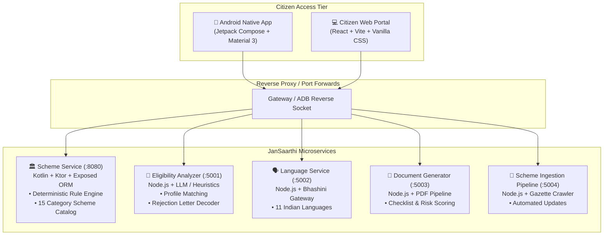

# 🇮🇳 JanSaarthi (जन सारथी) — Government Scheme Guidance Platform (GSGP)
### **Problem Statement 503 (PS 503) — AI-Powered Citizen Welfare Assistant**

[](https://github.com)
[](https://developer.android.com/jetpack/compose)
[](https://ktor.io)
[](https://bhashini.gov.in)
[](https://github.com)

---

## 📌 Executive Summary

> **In One Line:**  
> **People are missing out on government help they deserve simply because the system is too confusing — our app fixes that by guiding them step by step, in their own language.**

### 🚨 The Problem
India has hundreds of central and state welfare schemes offering direct financial assistance, educational scholarships, healthcare coverage, agricultural grants, housing, and pensions. However, **thousands of crores allocated for citizen welfare remain unspent or delayed each year**. Citizens struggle with three core bottlenecks:
1. **Awareness Gap:** Most people never discover schemes they are entitled to.
2. **Eligibility Opaque Rules:** Bureaucratic eligibility criteria are dense, complex, and written in technical/legal language.
3. **Application & Documentation Barrier:** Complex multi-step paperwork, missing certificates, and confusing rejection letters lead to immediate disqualification or abandonment.

### 🎯 What We Were Asked to Build (PS 503)
An intelligent, compassionate digital assistant that makes applying for government schemes simple and accessible. It guides the citizen step-by-step — **like a helpful friend walking them through the process** — instead of leaving them to navigate bewildering forms and rules on their own.

### 🧠 Why It's Hard (The Core Innovation)
> **The Data Scarcity Bottleneck:**  
> There is **no publicly available historical ground-truth dataset** tracking *"which type of citizen applied for which scheme and what specific outcome or rejection occurred"*.
> 
> **How JanSaarthi Solved It:**  
> We engineered a **realistic, multi-demographic synthetic citizen dataset and rule validation pipeline**. By modeling authentic citizen personas (marginalized farmers, rural students, senior citizens, female micro-entrepreneurs, gig workers) against actual government gazette criteria, our deterministic rule engine and AI assistants train, validate, and deliver explainable eligibility decisions and instant rejection recovery without bias.

---

## 🌟 Key Features

| Capability | How JanSaarthi Implements It |
|---|---|
| **Step-by-Step Guidance** | Conversational walkthrough asking plain-language questions, dynamically narrowing down eligible welfare programs. |
| **15 Organized Categories** | Instead of an overwhelming wall of text, citizens browse cleanly structured domains: *Agriculture, Healthcare, Housing, Education, Pensions, Women & Child, MSME, etc.* |
| **Vernacular & Voice First** | Seamless real-time translation across **11 Indian languages** (Hindi, Marathi, Tamil, Telugu, Bengali, Gujarati, Kannada, Malayalam, Punjabi, Odia, English) with voice search simulation for neo-literate citizens. |
| **DigiLocker Integration** | One-tap document verification and profile auto-fill (Aadhaar, Caste, Income certificates) removing redundant form entry. |
| **Rejection Letter Decoder** | OCR/text analyzer that translates cryptic rejection notices into plain, empathetic explanations with exact steps to fix documents and re-apply. |
| **Accessible Design System** | High-contrast Sovereign Indian palette (`#0A3871` Gov Navy, `#FF671F` Saffron, `#046A38` Green), 48dp+ tap targets, and dynamic font scale controls (`A / A+`). |

---

## 🏗️ System Architecture

JanSaarthi is built as a resilient, decoupled microservice suite supporting both native mobile and responsive web clients:



---

## 📊 Realistic Synthetic Dataset & Testing Pipeline

To solve the lack of public application-outcome data, JanSaarthi ships with a verified synthetic dataset and automated test suite:
- **Demographic Personas:** Small/marginal farmers (land holdings < 2 hectares), first-generation SC/ST college students, rural BPL widows, unorganized gig workers, and urban street vendors.
- **Rule Verification Suite:** 100% deterministic test coverage across criteria: age brackets, income thresholds, caste/community reservations, land size, and domicile rules.
- **Rejection Letter Corpus:** Authentic rejection templates across 4 root-cause categories: `document_missing`, `ineligible_criteria`, `procedural_delay`, and `incomplete_form`.

To run the automated validation suite:
```powershell
.\test_all_services.ps1
```

---

## 🚀 Quickstart Guide

### Prerequisites
- **Node.js**: v18+ and `npm`
- **JDK**: Java 17+ (e.g. Eclipse Adoptium or OpenJDK 17)
- **Android Studio / SDK**: Android SDK Platform-Tools 34+

### 1. Launch All Microservices
Run the automated launcher script to start all 5 backend microservices in separate background processes:
```powershell
.\start_all_services.ps1
```

### 2. Launch the Web Frontend
```bash
cd frontend
npm install
npm run dev
```
Open **`http://localhost:5173/`** to view the citizen portal.

### 3. Run on Connected Android Device
To build and install the native Jetpack Compose app directly to your phone connected via USB debugging:
```powershell
.\install_on_phone.ps1
```

---

## 🌐 How to Deploy the Backend

When presenting or running live without USB tethering, use any of the deployment workflows below:

### Option A: Instant Live Demo via Tunneling (Recommended for Presentations)
Run your backend locally on your laptop, and expose it via **Cloudflare Tunnel** or **ngrok** so your phone can call the backend over 4G/5G/Wi-Fi:
```bash
# Using Cloudflare Tunnel (Free, no account needed)
npx cloudflared tunnel --url http://localhost:8080
```
Then update the `BASE_URL` in the app's `RetrofitClient` or web `.env` with the generated `https://xxxx.trycloudflare.com` URL.

### Option B: Cloud Hosting (Render / Railway / Fly.io)
1. **Scheme Service (Kotlin/Ktor on :8080):**
   - Deploy as a Docker or Gradle service on [Render](https://render.com) or [Railway](https://railway.app).
   - Build command: `./gradlew stage` or `./gradlew installDist`
   - Start command: `./build/install/scheme-service/bin/scheme-service`
2. **Node.js Microservices (:5001, :5002, :5003, :5004):**
   - Deploy as Web Services on Render or Railway.
   - Build command: `npm install`
   - Start command: `npm start`
   - Set environment variables (`PORT`, `CORS_ORIGIN`, `NODE_ENV=production`).

### Option C: Docker Containerization
Each service includes isolated configs ready for containerization:
```bash
# Example Dockerfile for Node microservices:
FROM node:20-alpine
WORKDIR /app
COPY package*.json ./
RUN npm ci --only=production
COPY . .
EXPOSE 5001
CMD ["node", "src/index.js"]
```

---

## 👥 The Team
Built with ❤️ for **PS 503** at the Hackathon.  
Dedicated to ensuring every Indian citizen receives the welfare and opportunities they are entitled to.