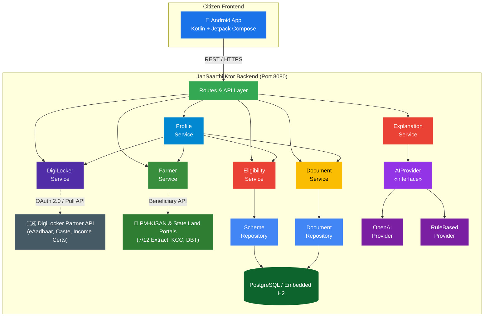

# JanSaarthi — Scheme Eligibility & Guidance Service

> **Ktor backend** that helps citizens discover government schemes they may
> be eligible for, check their document readiness, and understand official
> government notices — with direct **DigiLocker integration** and a dedicated
> **Farmer workflow** — all from a single unified API.

> [!WARNING]
> **DEMO DATA** — The scheme dataset shipped with this prototype is for
> demonstration purposes only. Before any public deployment, replace
> the demo data in `DatabaseSeeder.kt` with verified information sourced
> directly from official government portals.

---

## Architecture



### Core Responsibilities

| # | Responsibility | Service | Endpoint |
|---|----------------|---------|----------|
| 1 | **DigiLocker Auth & Docs** — Auto-fetch authentic citizen certificates | `DigiLockerService` | `GET /api/profile/digilocker/*` |
| 2 | **Farmer Workflow** — Landholdings, PM-KISAN, KCC & DBT status | `FarmerService` | `POST /api/profile/farmer` |
| 3 | **Unified Profile & Readiness** — End-to-end check across modes | `ProfileService` | `POST /api/profile/check-eligibility` |
| 4 | **Eligibility Engine** — Transparent deterministic rule matching | `EligibilityService` | `POST /api/schemes/check-eligibility` |
| 5 | **Document Readiness** — Compare available docs & compute % | `DocumentService` | `POST /api/documents/check-readiness` |
| 6 | **Notice Explanation** — Simplify official rejection letters & notices | `ExplanationService` → `AIProvider` | `POST /api/explain` |
| 7 | **Scheme Discovery** — Filterable catalog of central & state welfare | `SchemeRepository` | `GET /api/schemes` |

---

## Requirements

| Requirement   | Version |
|---------------|---------|
| JDK           | 17+     |
| Gradle        | 8.x     |
| PostgreSQL    | 14+ (or zero-setup embedded H2 fallback) |

---

## Quick Start

### 1. Configure environment variables (optional)

```bash
cp .env.example .env
# Edit .env with your actual database credentials if using external PostgreSQL
```

| Variable           | Description                            | Default                                      |
|--------------------|----------------------------------------|----------------------------------------------|
| `PORT`             | Server port                            | `8080`                                       |
| `DATABASE_URL`     | JDBC connection string                 | `jdbc:postgresql://localhost:5432/jansaarthi` |
| `DATABASE_USER`    | PostgreSQL username                    | `postgres`                                   |
| `DATABASE_PASSWORD`| PostgreSQL password                    | `postgres`                                   |
| `AI_API_KEY`       | Optional AI key for `/api/explain`     | *(empty — uses rule-based fallback)*         |

> **Note**: If PostgreSQL is not running locally, the server **automatically falls back to an embedded H2 database** in PostgreSQL compatibility mode, initializing and pre-seeding all 22 schemes immediately.

### 2. Build & run

```bash
# Windows
.\gradlew.bat run

# macOS / Linux
./gradlew run
```

The server starts on **http://localhost:8080**.

---

## Available Endpoints

| Method | Path                                  | Description                                         |
|--------|---------------------------------------|-----------------------------------------------------|
| GET    | `/health`                             | System health check                                 |
| GET    | `/api/schemes`                        | List schemes (`?state=` and `?category=` filters)   |
| GET    | `/api/schemes/state-portals`          | Official state portals directory (`?state=` filter) |
| GET    | `/api/schemes/{schemeId}`             | Full details and eligibility criteria for a scheme  |
| POST   | `/api/schemes/check-eligibility`      | Direct citizen demographic eligibility check       |
| POST   | `/api/documents/check-readiness`      | Check document readiness for a single scheme        |
| POST   | `/api/documents/check-readiness/bulk` | Check readiness across multiple schemes in bulk     |
| GET    | `/api/documents/required/{schemeId}`  | List required documents for a scheme                |
| POST   | `/api/explain`                        | Explain an official government notice / letter      |
| GET    | `/api/profile/digilocker/auth`        | Generate DigiLocker OAuth authorization URL         |
| POST   | `/api/profile/digilocker/callback`    | Exchange authorization code for access token        |
| GET    | `/api/profile/digilocker/documents`   | Pull citizen's verified documents from DigiLocker  |
| POST   | `/api/profile/farmer`                 | Build farmer profile with PM-KISAN and land status  |
| POST   | `/api/profile/build`                  | Build unified profile (`manual`, `digilocker`, `farmer`) |
| POST   | `/api/profile/check-eligibility`      | **End-to-End**: Build profile + Match + Doc Readiness |

---

## Testing with cURL / PowerShell

### 1. Health check

```bash
curl http://localhost:8080/health
```

### 2. State Portals Directory

```bash
# List all 17 registered official state portals
curl http://localhost:8080/api/schemes/state-portals

# Filter portals by state (e.g. Maharashtra: MahaDBT, Aaple Sarkar, MahaBhumi, State Govt)
curl "http://localhost:8080/api/schemes/state-portals?state=Maharashtra"
```

### 3. Scheme Discovery & State Filtering

```bash
# All 35 pre-seeded welfare schemes
curl http://localhost:8080/api/schemes

# Filter schemes for Karnataka (Central + Karnataka specific)
curl "http://localhost:8080/api/schemes?state=Karnataka"
```

### 2. DigiLocker OAuth Flow

```bash
# Step 1: Citizen taps "Connect DigiLocker" — App requests authorization URL
curl http://localhost:8080/api/profile/digilocker/auth

# Step 2: User consents — App sends authorization code to callback endpoint
curl -X POST http://localhost:8080/api/profile/digilocker/callback \
  -H "Content-Type: application/json" \
  -d '{"authorizationCode": "auth_code_12345", "state": "session_state_xyz"}'

# Step 3: Fetch verified documents using access token
curl http://localhost:8080/api/profile/digilocker/documents?token=dl_token_demo
```

### 3. Farmer-Specific Flow

```bash
curl -X POST http://localhost:8080/api/profile/farmer \
  -H "Content-Type: application/json" \
  -d '{
    "aadhaarLinked": true,
    "pmKisanBeneficiary": true,
    "landOwnership": {
      "hasLand": true,
      "landAreaAcres": 1.5,
      "landType": "irrigated"
    },
    "kisanCreditCard": true,
    "state": "Maharashtra",
    "district": "Kolhapur"
  }'
```

*Response classifies farmer as **marginal** (< 2.47 acres), confirms active PM-KISAN DBT status, pulls Land Record (7/12 extract), KCC, and recommends targeted schemes (PM-KISAN, PM Fasal Bima, KCC, MGNREGA, PM Ujjwala, Ayushman Bharat).*

### 4. End-to-End Profile Eligibility (Farmer Mode)

```bash
curl -X POST http://localhost:8080/api/profile/check-eligibility \
  -H "Content-Type: application/json" \
  -d '{
    "mode": "farmer",
    "state": "Maharashtra",
    "district": "Kolhapur",
    "farmerProfile": {
      "aadhaarLinked": true,
      "pmKisanBeneficiary": true,
      "landOwnership": {
        "hasLand": true,
        "landAreaAcres": 1.5,
        "landType": "irrigated"
      },
      "kisanCreditCard": true,
      "state": "Maharashtra",
      "district": "Kolhapur"
    }
  }'
```

### 5. End-to-End Profile Eligibility (DigiLocker Mode)

```bash
curl -X POST http://localhost:8080/api/profile/check-eligibility \
  -H "Content-Type: application/json" \
  -d '{
    "mode": "digilocker",
    "digiLockerToken": "dl_token_demo",
    "occupation": "student",
    "isStudent": true
  }'
```

*Automatically extracts Age, Gender, State, Category (SC), Annual Income from verified Aadhaar, Caste, and Income certificates, checks scheme eligibility, and reports document readiness percentages for every matching scheme.*

### 6. Explain an Official Notice

```bash
curl -X POST http://localhost:8080/api/explain \
  -H "Content-Type: application/json" \
  -d '{
    "text": "As per the government order dated 15 March 2025, all eligible SC/ST students must submit their scholarship renewal applications before 30 April 2025. Applicants must visit the nearest District Social Welfare Office and provide updated income certificates."
  }'
```

---

## Project Structure

```
backend/scheme-service/
├── build.gradle.kts
├── settings.gradle.kts
├── .env.example
├── .gitignore
├── FEATURES.md                            # Comprehensive live features matrix
├── README.md                              # Architecture & API documentation
└── src/main/
    ├── kotlin/com/jansaarthi/schemes/
    │   ├── Application.kt                 # Ktor server setup, dependency injection & routing
    │   ├── ai/
    │   │   ├── AIProvider.kt              # AI provider abstraction interface
    │   │   ├── RuleBasedProvider.kt       # Deterministic NLP parser fallback
    │   │   └── OpenAIProvider.kt          # LLM integration provider
    │   ├── config/
    │   │   ├── DatabaseConfig.kt          # Dual-engine connection pool (PostgreSQL + H2)
    │   │   ├── DatabaseSeeder.kt          # 22 pre-seeded welfare schemes with rules
    │   │   └── Tables.kt                  # Exposed ORM schema definitions
    │   ├── models/
    │   │   ├── Scheme.kt                  # Scheme DTOs
    │   │   ├── UserProfile.kt             # Demographic profile DTO
    │   │   ├── ProfileModels.kt           # DigiLocker, Farmer & Unified profile DTOs
    │   │   ├── EligibilityResult.kt       # Rule evaluation result DTOs
    │   │   ├── Document.kt                # Document checklist & readiness DTOs
    │   │   ├── ExplainModels.kt           # Notice explainer request/response
    │   │   └── ErrorResponse.kt           # Standardized error response
    │   ├── repositories/
    │   │   ├── SchemeRepository.kt         # Database access for schemes & rules
    │   │   └── DocumentRepository.kt       # Document requirement queries
    │   ├── routes/
    │   │   ├── HealthRoutes.kt             # GET /health
    │   │   ├── SchemeRoutes.kt             # /api/schemes/* + /api/explain
    │   │   ├── DocumentRoutes.kt           # /api/documents/*
    │   │   └── ProfileRoutes.kt            # /api/profile/* (DigiLocker, Farmer, Unified)
    │   └── services/
    │       ├── DigiLockerService.kt        # OAuth 2.0 flow & government document pull
    │       ├── FarmerService.kt            # Land classification, PM-KISAN, KCC enrichment
    │       ├── ProfileService.kt           # Unified profile orchestrator (manual/digilocker/farmer)
    │       ├── EligibilityService.kt       # Multi-condition rule evaluation engine
    │       ├── DocumentService.kt          # Fuzzy matching & readiness score calculation
    │       └── ExplanationService.kt       # Official notice analysis orchestrator
    └── resources/
        ├── application.conf
        └── logback.xml
```

---

## Security & Verification Standards

- **Provenance Tracking**: Every profile field records whether it was `SELF_DECLARED` or verified by government authorities (`DIGILOCKER_AADHAAR`, `PM_KISAN_API`, `LAND_RECORD_CLASSIFICATION`).
- **No Credential Storage**: Citizen Aadhaar numbers and private documents are not stored in the database.
- **Fail-Safe Operation**: Embeds automatic H2 database fallback and zero-key NLP explanation fallback so services never crash during hackathon demos or offline judging.
