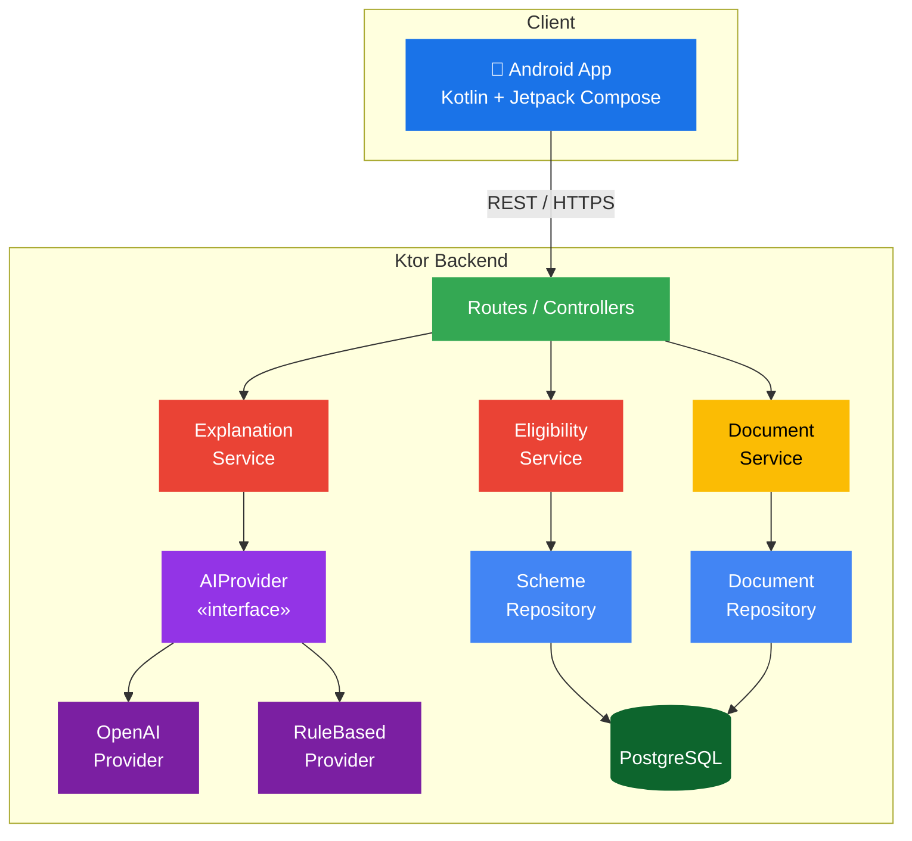

# JanSaarthi — Scheme Eligibility & Guidance Service

> **Ktor backend** that helps citizens discover government schemes they may
> be eligible for, check their document readiness, and understand official
> government notices — all from a single API.

> [!WARNING]
> **DEMO DATA** — The scheme dataset shipped with this prototype is for
> demonstration purposes only.  Before any public deployment, replace
> the demo data in `DatabaseSeeder.kt` with verified information sourced
> directly from official government portals.

---

## Architecture



### 4 Core Responsibilities

| # | Responsibility | Service | Endpoint |
|---|----------------|---------|----------|
| 1 | **Eligibility** — "Which schemes may apply to me?" | `EligibilityService` | `POST /api/schemes/check-eligibility` |
| 2 | **Documents** — "What do I have and what's missing?" | `DocumentService` | `POST /api/documents/check-readiness` |
| 3 | **Explanation** — "What does this government notice mean?" | `ExplanationService` → `AIProvider` | `POST /api/explain` |
| 4 | **Scheme Data** — "What are the official requirements?" | `SchemeRepository` | `GET /api/schemes/{id}` |

---

## Requirements

| Requirement   | Version |
|---------------|---------|
| JDK           | 17+     |
| Gradle        | 8.x     |
| PostgreSQL    | 14+     |

---

## Quick Start

### 1. Create a PostgreSQL database

```sql
CREATE DATABASE jansaarthi;
```

### 2. Configure environment variables

```bash
cp .env.example .env
# Edit .env with your actual database credentials
```

| Variable           | Description                            | Default                                      |
|--------------------|----------------------------------------|----------------------------------------------|
| `PORT`             | Server port                            | `8080`                                       |
| `DATABASE_URL`     | JDBC connection string                 | `jdbc:postgresql://localhost:5432/jansaarthi` |
| `DATABASE_USER`    | PostgreSQL username                    | `postgres`                                   |
| `DATABASE_PASSWORD`| PostgreSQL password                    | `postgres`                                   |
| `AI_API_KEY`       | Optional AI key for `/api/explain`     | *(empty — uses rule-based fallback)*         |

### 3. Build & run

```bash
# Windows
.\gradlew.bat run

# macOS / Linux
./gradlew run
```

The server starts on **http://localhost:8080**.

---

## Available Endpoints

| Method | Path                                  | Description                                         |
|--------|---------------------------------------|-----------------------------------------------------|
| GET    | `/health`                             | Health check                                        |
| GET    | `/api/schemes`                        | List schemes (`?state=` and `?category=` filters)   |
| GET    | `/api/schemes/{schemeId}`             | Full details for a single scheme                    |
| POST   | `/api/schemes/check-eligibility`      | Check which schemes match a user profile            |
| POST   | `/api/documents/check-readiness`      | Check document readiness for a scheme               |
| POST   | `/api/documents/check-readiness/bulk` | Check readiness across multiple schemes             |
| GET    | `/api/documents/required/{schemeId}`  | List required documents for a scheme                |
| POST   | `/api/explain`                        | Explain an official government notice               |

---

## Testing with cURL

### Health check

```bash
curl http://localhost:8080/health
```

### List all schemes

```bash
curl http://localhost:8080/api/schemes
```

### Filter schemes by state

```bash
curl "http://localhost:8080/api/schemes?state=Maharashtra"
```

### Filter schemes by category

```bash
curl "http://localhost:8080/api/schemes?category=education"
```

### Get scheme details

```bash
curl http://localhost:8080/api/schemes/SCH001
```

### Check eligibility

```bash
curl -X POST http://localhost:8080/api/schemes/check-eligibility \
  -H "Content-Type: application/json" \
  -d '{
    "age": 19,
    "state": "Maharashtra",
    "district": "Kolhapur",
    "occupation": "student",
    "student": true,
    "annualIncome": 250000,
    "category": "SC"
  }'
```

### Check document readiness (single scheme)

```bash
curl -X POST http://localhost:8080/api/documents/check-readiness \
  -H "Content-Type: application/json" \
  -d '{
    "schemeId": "SCH001",
    "availableDocuments": ["Aadhaar Card", "Bank Passbook"]
  }'
```

### Check document readiness (bulk — multiple schemes)

```bash
curl -X POST http://localhost:8080/api/documents/check-readiness/bulk \
  -H "Content-Type: application/json" \
  -d '{
    "availableDocuments": ["Aadhaar Card", "Bank Passbook", "PAN Card"],
    "schemeIds": ["SCH001", "SCH003", "SCH005"]
  }'
```

### List required documents

```bash
curl http://localhost:8080/api/documents/required/SCH001
```

### Explain an official notice

```bash
curl -X POST http://localhost:8080/api/explain \
  -H "Content-Type: application/json" \
  -d '{
    "text": "As per the government order dated 15 March 2025, all eligible SC/ST students must submit their scholarship renewal applications before 30 April 2025. Applicants must visit the nearest District Social Welfare Office and provide updated income certificates."
  }'
```

### Test invalid input (should return 400)

```bash
curl -X POST http://localhost:8080/api/schemes/check-eligibility \
  -H "Content-Type: application/json" \
  -d '{
    "age": -5,
    "state": "",
    "occupation": "",
    "annualIncome": -100,
    "category": "INVALID"
  }'
```

### Test nonexistent scheme (should return 404)

```bash
curl http://localhost:8080/api/schemes/NONEXISTENT
```

---

## Project Structure

```
backend/scheme-service/
├── build.gradle.kts
├── settings.gradle.kts
├── .env.example
├── .gitignore
├── README.md
└── src/main/
    ├── kotlin/com/jansaarthi/schemes/
    │   ├── Application.kt                 # Entry point + wiring
    │   ├── ai/
    │   │   ├── AIProvider.kt              # Provider interface
    │   │   ├── RuleBasedProvider.kt        # Deterministic fallback
    │   │   └── OpenAIProvider.kt           # LLM stub (ready for integration)
    │   ├── config/
    │   │   ├── DatabaseConfig.kt           # HikariCP + Exposed init
    │   │   ├── DatabaseSeeder.kt           # Demo data (22 schemes)
    │   │   └── Tables.kt                  # Exposed table definitions
    │   ├── models/
    │   │   ├── Scheme.kt                   # Scheme response DTOs
    │   │   ├── UserProfile.kt              # Eligibility request DTO
    │   │   ├── EligibilityResult.kt        # Eligibility response DTOs
    │   │   ├── Document.kt                 # Document readiness DTOs
    │   │   ├── ExplainModels.kt            # Explain request/response
    │   │   └── ErrorResponse.kt            # Standardised error DTO
    │   ├── repositories/
    │   │   ├── SchemeRepository.kt          # Scheme data access
    │   │   └── DocumentRepository.kt        # Document requirement queries
    │   ├── routes/
    │   │   ├── HealthRoutes.kt              # GET /health
    │   │   ├── SchemeRoutes.kt              # /api/schemes/* + /api/explain
    │   │   └── DocumentRoutes.kt            # /api/documents/*
    │   └── services/
    │       ├── EligibilityService.kt        # Rule-based eligibility engine
    │       ├── DocumentService.kt           # Document readiness checker
    │       └── ExplanationService.kt        # AI provider orchestrator
    └── resources/
        ├── application.conf
        └── logback.xml
```

---

## Security Notes

- **Never** commit `.env` files or hardcode API keys.
- CORS is restricted to `http://localhost:3000` (dev frontend only).
- Request body size is limited to 1 MB.
- All user input is validated; malformed requests return HTTP 400.
- Stack traces and internal details are never exposed to clients.
- No sensitive information (Aadhaar, bank details) is logged.
- Government documents are not stored permanently.

---

## Disclaimer

This service provides **potential eligibility suggestions** based on
user-supplied information.  It does **not** constitute official approval.
The final eligibility decision belongs to the relevant government
authority.  Always verify through official channels.
